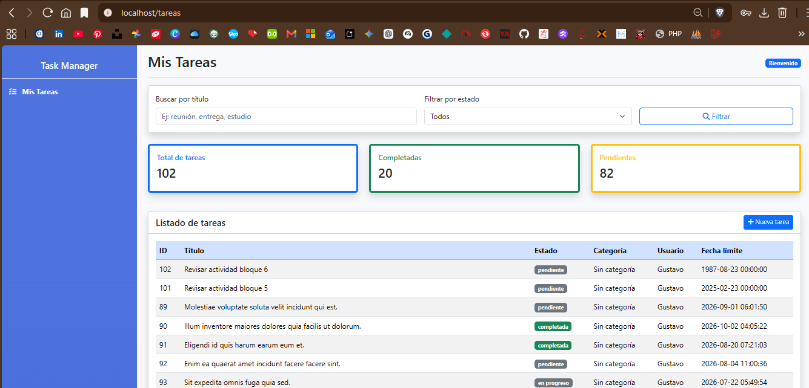

# Task Manager en Laravel

Proyecto desarrollado en Laravel y MySQL para la gestión básica de tareas, categorías y usuarios.

## Objetivo

Implementar una aplicación web que permita registrar, listar y consultar tareas, asociándolas con una categoría, un usuario responsable, un estado y una fecha límite.

## Tecnologías utilizadas

- Laravel
- PHP
- MySQL
- Laravel Sail
- Docker
- Blade
- Git
- GitHub

## Funcionalidades desarrolladas

- Creación del proyecto Laravel.
- Configuración del entorno con Laravel Sail.
- Creación de migraciones para tareas y categorías.
- Relación de tareas con categorías.
- Relación de tareas con usuarios.
- Creación de modelos `Task`, `Category` y `User`.
- Creación de factories y seeders.
- Creación del controlador `TaskController`.
- Creación de vistas Blade para listar y crear tareas.
- Configuración de rutas en `web.php`.
- Validación del guardado de tareas en base de datos.
- Subida del proyecto a GitHub en la rama `task-manager`.

```md
## Estructura principal del proyecto

El proyecto se organiza siguiendo la estructura básica de Laravel. Los archivos más importantes desarrollados durante esta etapa fueron:

| Archivo o carpeta | Descripción |
|---|---|
| `app/Models/Task.php` | Modelo encargado de representar las tareas del sistema. |
| `app/Models/Category.php` | Modelo encargado de representar las categorías asociadas a las tareas. |
| `app/Http/Controllers/TaskController.php` | Controlador principal para gestionar el listado y creación de tareas. |
| `database/migrations/` | Carpeta donde se encuentran las migraciones para crear y modificar las tablas de la base de datos. |
| `database/factories/` | Carpeta donde se definen datos de prueba para usuarios, tareas y categorías. |
| `database/seeders/` | Carpeta donde se cargan datos iniciales en la base de datos. |
| `resources/views/tareas/` | Carpeta que contiene las vistas Blade relacionadas con el módulo de tareas. |
| `resources/views/layouts/app.blade.php` | Plantilla principal utilizada por las vistas del proyecto. |
| `routes/web.php` | Archivo donde se definen las rutas web de la aplicación. |
|`resources/views/tareas/` | Carpeta que contiene las vistas Blade relacionadas con el módulo de tareas. |
|`resources/views/layouts/app.blade.php` | Plantilla principal utilizada por las vistas del proyecto. |
|`routes/web.php` | Archivo donde se definen las rutas web de la aplicación. |

## Evidencia de ejecucion y configuración Task Manager-Tareas




