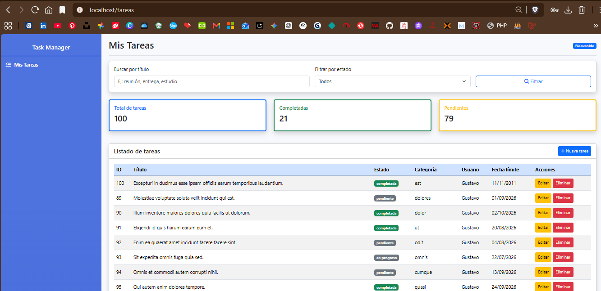
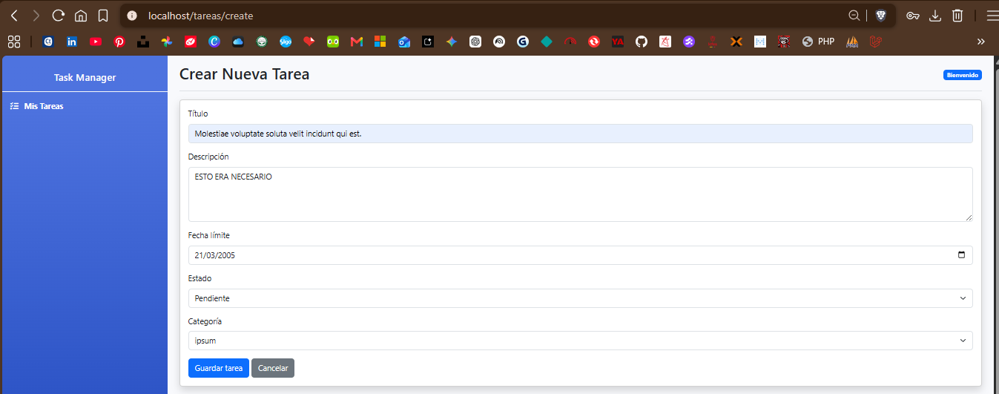
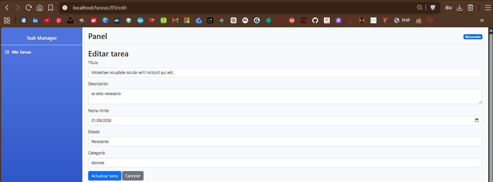
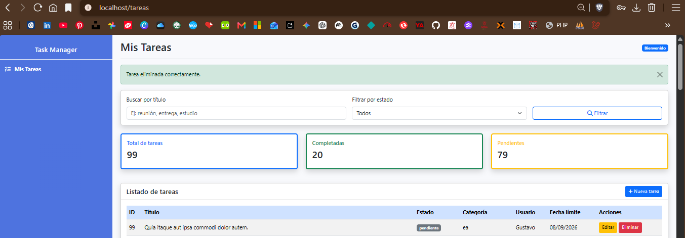

# Documentación Módulo III - ORM Eloquent

## Proyecto

Task Manager es una aplicación web desarrollada en Laravel para gestionar tareas personales. El proyecto utiliza Eloquent ORM para manejar la comunicación con la base de datos mediante modelos, migraciones, relaciones, seeders, factories, scopes y consultas optimizadas.

## Entidades principales

El sistema utiliza tres entidades principales:

| Entidad | Descripción |
|---|---|
| User | Usuario propietario de las tareas. |
| Category | Categoría usada para clasificar tareas. |
| Task | Tarea registrada en el sistema. |

## Relaciones

| Relación | Tipo |
|---|---|
| User tiene muchas Tasks | 1:N |
| Category tiene muchas Tasks | 1:N |
| Task pertenece a User | N:1 |
| Task pertenece a Category | N:1 |

## Funcionalidades implementadas

- Migraciones para `categories` y `tasks`.
- Modelos `Task` y `Category`.
- Relaciones `hasMany` y `belongsTo`.
- Seeders y factories con datos falsos.
- Listado de tareas.
- Eager loading con `user` y `category`.
- Filtros por título y estado.
- Scopes locales para búsqueda y estado.
- Tarjetas de estadísticas.
- Creación de tareas con validación y CSRF.
- Edición de tareas.
- Eliminación de tareas.
- Formato de fecha límite sin hora en la vista principal.

## Rutas principales

| Ruta | Descripción |
|---|---|
| `/tareas` | Listado de tareas. |
| `/tareas/create` | Formulario para crear tarea. |
| `/tareas/{tarea}/edit` | Formulario para editar tarea. |

## Comandos de instalación y ejecución

Instalar dependencias:

```bash
composer install
npm install
```

Copiar archivo de entorno:

```bash
cp .env.example .env
```

Generar clave de aplicación:

```bash
sail php artisan key:generate
```

Ejecutar migraciones y seeders:

```bash
sail php artisan migrate:fresh --seed
```

Levantar el proyecto:

```bash
sail up -d
```

Ingresar en el navegador:

```text
http://localhost/tareas
```

## Archivos de documentación

| Archivo | Descripción |
|---|---|
| `docs/diccionario.md` | Diccionario de datos del proyecto. |
| `docs/mer_task_manager.md` | Modelo entidad-relación del proyecto. |
| `docs/README.md` | Documentación general del Módulo III. |

## Evidencias del funcionamiento

A continuación se presentan las evidencias del CRUD implementado para el proyecto Task Manager.

| Evidencia | Descripción |
|---|---|
|  | Listado principal de tareas con datos cargados desde la base de datos. |
|  | Formulario de creación de una nueva tarea. |
|  | Formulario de edición de una tarea existente. |
|  | Evidencia del proceso de eliminación de una tarea. |
