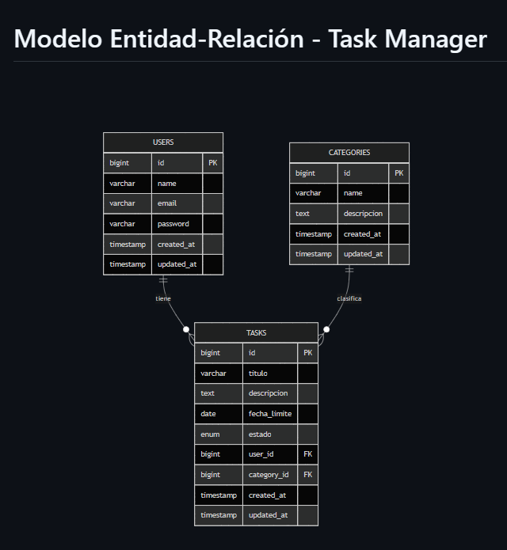
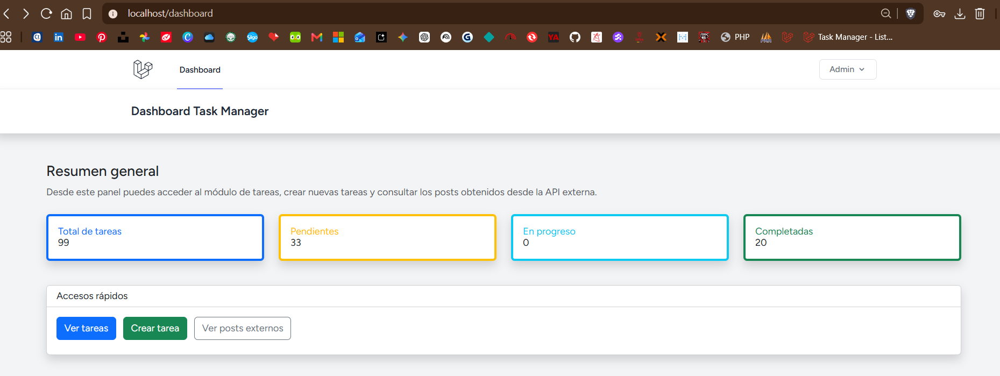
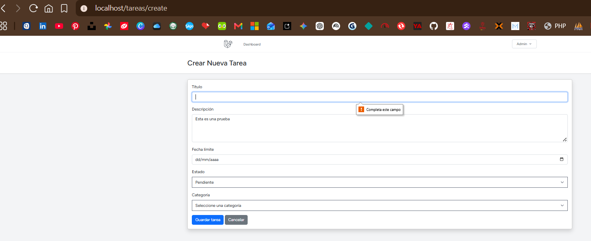
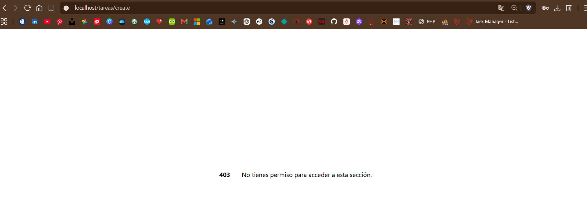
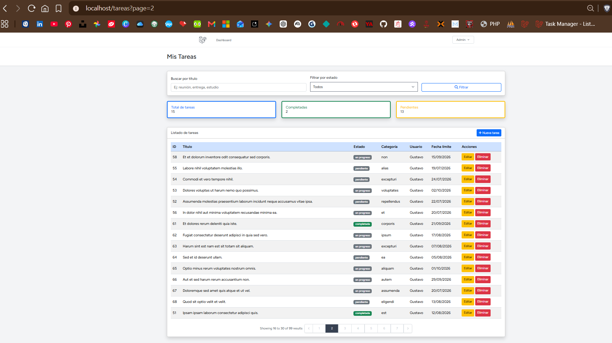
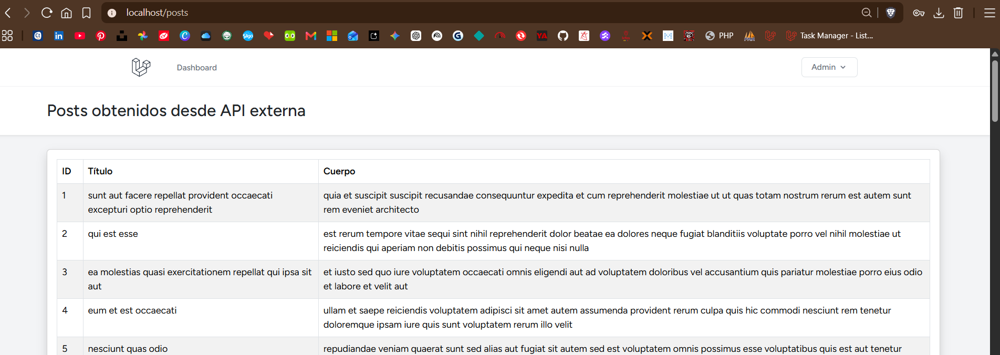
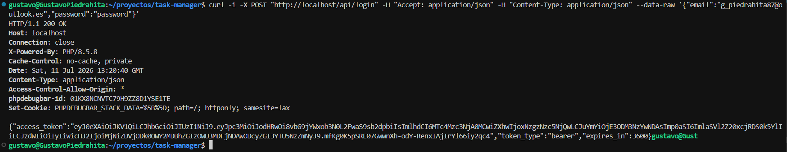
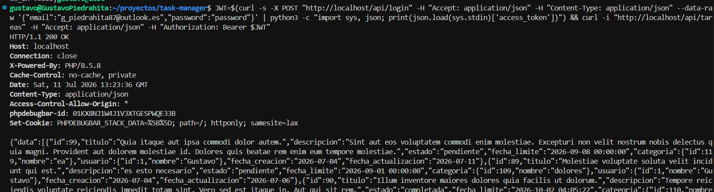

# Documentación Módulo III - ORM Eloquent

## Proyecto

Task Manager es una aplicación web desarrollada en Laravel para gestionar tareas personales. El proyecto utiliza Eloquent ORM para manejar la comunicación con la base de datos mediante modelos, migraciones, relaciones, seeders, factories, scopes y consultas optimizadas.

## Entidades principales

El sistema utiliza tres entidades principales:

| Entidad | Descripción |
|---|---|
| User | Usuario propietario de las tareas. |
| Category | Categoría usada para clasificar tareas. |
| Task | Tarea registrada en el sistema. |

## Relaciones

| Relación | Tipo |
|---|---|
| User tiene muchas Tasks | 1:N |
| Category tiene muchas Tasks | 1:N |
| Task pertenece a User | N:1 |
| Task pertenece a Category | N:1 |

## Funcionalidades implementadas

- Migraciones para `categories` y `tasks`.
- Modelos `Task` y `Category`.
- Relaciones `hasMany` y `belongsTo`.
- Seeders y factories con datos falsos.
- Listado de tareas.
- Eager loading con `user` y `category`.
- Filtros por título y estado.
- Scopes locales para búsqueda y estado.
- Tarjetas de estadísticas.
- Creación de tareas con validación y CSRF.
- Edición de tareas.
- Eliminación de tareas.
- Formato de fecha límite sin hora en la vista principal.

## Rutas principales

| Ruta | Descripción |
|---|---|
| `/tareas` | Listado de tareas. |
| `/tareas/create` | Formulario para crear tarea. |
| `/tareas/{tarea}/edit` | Formulario para editar tarea. |

## Comandos de instalación y ejecución

Instalar dependencias:

```bash
composer install
npm install
```

Copiar archivo de entorno:

```bash
cp .env.example .env
```

Generar clave de aplicación:

```bash
sail php artisan key:generate
```

Ejecutar migraciones y seeders:

```bash
sail php artisan migrate:fresh --seed
```

Levantar el proyecto:

```bash
sail up -d
```

Ingresar en el navegador:

```text
http://localhost/tareas
```

## Archivos de documentación

| Archivo | Descripción |
|---|---|
| `docs/diccionario.md` | Diccionario de datos del proyecto. |
| `docs/mer_task_manager.md` | Modelo entidad-relación del proyecto. |
| `docs/README.md` | Documentación general del Módulo III. |

## Evidencias del funcionamiento

A continuación se presentan las evidencias del CRUD implementado para el proyecto Task Manager.

| Evidencia | Descripción |
|---|---|
|  | Listado principal de tareas con datos cargados desde la base de datos. |
|  | Formulario de creación de una nueva tarea. |
|  | Formulario de edición de una tarea existente. |
|  | Evidencia del proceso de eliminación de una tarea. |
|  | Modelo entidad-relación actualizado del proyecto Task Manager. |
---

# Documentación Módulo IV - Seguridad, APIs, JWT, API Externa y Paginación

## Descripción general

En el Módulo IV se amplió el proyecto **Task Manager** con funcionalidades relacionadas con seguridad, autenticación, autorización, consumo de servicios externos, API REST y autenticación mediante tokens.

El proyecto ya contaba con el CRUD de tareas desarrollado en Laravel. A partir de esta base, se agregaron nuevas funciones para proteger rutas, validar formularios, restringir acciones según el rol del usuario, consumir una API externa, exponer endpoints propios y mejorar la navegación del listado mediante paginación.

## Funcionalidades implementadas

* Instalación y configuración de Laravel Breeze.
* Protección de rutas con autenticación.
* Validaciones en formularios Blade.
* Uso de `@csrf`, `@error` y `old()` en formularios.
* Validación de título único en tareas.
* Creación de columna `rol` en la tabla `users`.
* Creación de middleware personalizado `VerificarRol`.
* Restricción del formulario de creación de tareas solo para usuarios administradores.
* Integración de un dashboard con estadísticas y accesos rápidos.
* Implementación de una API REST para tareas.
* Pruebas iniciales de API protegida con token.
* Instalación y configuración de JWT.
* Creación de endpoints de autenticación API: login, usuario autenticado y logout.
* Consumo de API externa mediante HTTP Client.
* Creación de vista `/posts` para mostrar datos externos.
* Implementación de paginación completa en el listado de tareas.
* Conservación de filtros mediante `withQueryString()`.

## Autenticación con Breeze

Se instaló Laravel Breeze para agregar al sistema las funciones básicas de autenticación. Con esto se incorporaron rutas y vistas para iniciar sesión, registrar usuarios, cerrar sesión y administrar el perfil.

Las rutas principales del sistema quedaron protegidas mediante el middleware `auth`, de manera que solo los usuarios autenticados pueden ingresar al dashboard, al módulo de tareas y a la vista de posts externos.

Rutas relacionadas:

| Ruta         | Descripción                                 |
| ------------ | ------------------------------------------- |
| `/login`     | Formulario de inicio de sesión.             |
| `/register`  | Formulario de registro de usuario.          |
| `/dashboard` | Panel principal del sistema.                |
| `/profile`   | Gestión del perfil del usuario autenticado. |

## Dashboard integrado

Se personalizó el dashboard inicial de Breeze para que no quedara separado del proyecto Task Manager.

El dashboard muestra un resumen general del sistema:

* Total de tareas.
* Tareas pendientes.
* Tareas en progreso.
* Tareas completadas.
* Botón para ver tareas.
* Botón para crear tareas, visible para usuarios administradores.
* Botón para ver posts externos.

Ruta del dashboard:

```text
http://localhost/dashboard
```

Evidencia:

```text
evidencias/modulo4/dashboard_modulo4.png
```



## Validaciones en Blade

En el formulario de creación de tareas se reforzó la validación usando Blade y el controlador.

En la vista se usaron:

* `@csrf` para proteger el formulario.
* `@error` para mostrar errores específicos por campo.
* `old()` para conservar los datos ingresados cuando ocurre un error.

En el controlador se agregó la validación del título como único:

```php
$validated = $request->validate([
    'titulo' => 'required|string|max:150|unique:tasks,titulo',
    'descripcion' => 'nullable|string',
    'fecha_limite' => 'nullable|date',
    'estado' => 'required|in:pendiente,en_progreso,completada',
    'category_id' => 'required|exists:categories,id',
]);
```

Ruta del formulario:

```text
http://localhost/tareas/create
```

Evidencia:

```text
evidencias/modulo4/formulario_validacion_tarea.png
```



## Middleware de roles

Se agregó la columna `rol` a la tabla `users` para diferenciar usuarios normales y administradores.

Roles utilizados:

| Rol       | Descripción                             |
| --------- | --------------------------------------- |
| `usuario` | Usuario normal del sistema.             |
| `admin`   | Usuario con permisos para crear tareas. |

Se creó el middleware personalizado `VerificarRol`, el cual valida si el usuario autenticado tiene el rol requerido para acceder a una ruta.

La creación de tareas quedó restringida para usuarios con rol `admin`:

```php
Route::middleware('rol:admin')->group(function () {
    Route::get('/tareas/create', [TaskController::class, 'create'])->name('tareas.create');
    Route::post('/tareas', [TaskController::class, 'store'])->name('tareas.store');
});
```

Cuando un usuario sin rol administrador intenta ingresar a la creación de tareas, el sistema responde con error `403`.

Ruta protegida:

```text
http://localhost/tareas/create
```

Evidencia:

```text
evidencias/modulo4/error_403_usuario_sin_rol.png
```



## Paginación del listado de tareas

Se agregó paginación completa al listado principal de tareas.

En el método `index` del controlador `TaskController` se reemplazó la consulta con `get()` por `paginate(15)`:

```php
$tareas = $query->orderBy('created_at', 'desc')
    ->paginate(15)
    ->withQueryString();
```

Este cambio permite mostrar 15 tareas por página y conservar los filtros activos cuando el usuario cambia de página.

En la vista `resources/views/tareas/index.blade.php` se agregó el paginador debajo de la tabla:

```php
<div class="mt-4 d-flex justify-content-center">
    {{ $tareas->links() }}
</div>
```

Ruta del listado:

```text
http://localhost/tareas
```

Evidencia:

```text
evidencias/modulo4/listado_tareas_paginador.png
```



## Consumo de API externa

Se creó el controlador `PostsController` para consumir una API pública usando el HTTP Client de Laravel.

La API consumida fue:

```text
https://jsonplaceholder.typicode.com/posts
```

Se creó la ruta `/posts`, donde se muestran los datos obtenidos en una tabla con los siguientes campos:

* ID.
* Título.
* Cuerpo del post.

Ruta implementada:

```text
http://localhost/posts
```

Evidencia:

```text
evidencias/modulo4/posts_api_externa.png
```



## API REST de tareas

Se implementó una API REST para el modelo `Task`. Esta API permite listar, crear, consultar, actualizar y eliminar tareas mediante respuestas en formato JSON.

Rutas principales:

| Método    | Ruta                  | Descripción                       |
| --------- | --------------------- | --------------------------------- |
| GET       | `/api/tareas`         | Lista las tareas en formato JSON. |
| POST      | `/api/tareas`         | Crea una nueva tarea.             |
| GET       | `/api/tareas/{tarea}` | Consulta una tarea específica.    |
| PUT/PATCH | `/api/tareas/{tarea}` | Actualiza una tarea.              |
| DELETE    | `/api/tareas/{tarea}` | Elimina una tarea.                |

Para estructurar la respuesta se creó el recurso `TaskResource`, el cual devuelve información de la tarea, la categoría y el usuario asociado.

Ejemplo de respuesta esperada:

```json
{
  "data": {
    "id": 104,
    "titulo": "Tarea API Gustavo",
    "descripcion": "Prueba creada desde API",
    "estado": "pendiente",
    "fecha_limite": "2026-07-20",
    "categoria": {
      "id": 119,
      "nombre": "ea"
    },
    "usuario": {
      "id": 2,
      "nombre": "Admin"
    }
  }
}
```

## Autenticación API con JWT

Se instaló el paquete `tymon/jwt-auth` para implementar autenticación mediante tokens JWT.

Se creó el controlador `Api/AuthController` con los métodos:

* `login`
* `me`
* `logout`

Rutas JWT implementadas:

| Método | Ruta          | Descripción                     |
| ------ | ------------- | ------------------------------- |
| POST   | `/api/login`  | Genera un token JWT.            |
| GET    | `/api/me`     | Muestra el usuario autenticado. |
| POST   | `/api/logout` | Cierra la sesión del token JWT. |

Ejemplo para iniciar sesión desde terminal:

```bash
curl -i -X POST "http://localhost/api/login" \
  -H "Accept: application/json" \
  -H "Content-Type: application/json" \
  --data-raw '{"email":"g_piedrahita87@outlook.es","password":"password"}'
```

La respuesta debe incluir:

```json
{
  "access_token": "TOKEN_GENERADO",
  "token_type": "bearer",
  "expires_in": 3600
}
```

Evidencia del login con JWT:

```text
evidencias/modulo4/api_jwt_login.png
```



## Consulta de tareas con JWT

Después de obtener el token JWT, se puede consultar la API protegida usando el encabezado `Authorization`.

Ejemplo:

```bash
curl -i "http://localhost/api/tareas" \
  -H "Accept: application/json" \
  -H "Authorization: Bearer TOKEN_JWT"
```

Si el token es válido, la respuesta debe ser:

```text
HTTP/1.1 200 OK
```

y debe mostrar las tareas en formato JSON.

Evidencia:

```text
evidencias/modulo4/api_tareas_jwt.png
```



## Resumen de rutas web

| Ruta                   | Descripción                                                         |
| ---------------------- | ------------------------------------------------------------------- |
| `/dashboard`           | Panel principal con estadísticas y accesos rápidos.                 |
| `/tareas`              | Listado de tareas con filtros y paginación.                         |
| `/tareas/create`       | Formulario para crear tareas, solo disponible para administradores. |
| `/tareas/{tarea}/edit` | Formulario para editar una tarea.                                   |
| `/posts`               | Vista de posts obtenidos desde una API externa.                     |

## Resumen de rutas API

| Método    | Ruta                  | Descripción                     |
| --------- | --------------------- | ------------------------------- |
| POST      | `/api/login`          | Genera un token JWT.            |
| GET       | `/api/me`             | Retorna el usuario autenticado. |
| POST      | `/api/logout`         | Cierra la sesión del token.     |
| GET       | `/api/tareas`         | Lista las tareas.               |
| POST      | `/api/tareas`         | Crea una tarea.                 |
| GET       | `/api/tareas/{tarea}` | Consulta una tarea específica.  |
| PUT/PATCH | `/api/tareas/{tarea}` | Actualiza una tarea.            |
| DELETE    | `/api/tareas/{tarea}` | Elimina una tarea.              |

## Evidencias del Módulo IV

| Evidencia                 | Ruta del archivo                                     | Descripción                                                    |
| ------------------------- | ---------------------------------------------------- | -------------------------------------------------------------- |
| Dashboard integrado       | `evidencias/modulo4/dashboard_modulo4.png`           | Muestra el panel principal con estadísticas y accesos rápidos. |
| Listado con paginador     | `evidencias/modulo4/listado_tareas_paginador.png`    | Muestra el listado de tareas con filtros y paginación.         |
| Formulario con validación | `evidencias/modulo4/formulario_validacion_tarea.png` | Muestra errores de validación en el formulario de creación.    |
| Error 403 por rol         | `evidencias/modulo4/error_403_usuario_sin_rol.png`   | Muestra la restricción para usuarios sin rol administrador.    |
| Posts API externa         | `evidencias/modulo4/posts_api_externa.png`           | Muestra los datos obtenidos desde la API externa.              |
| Login JWT                 | `evidencias/modulo4/api_jwt_login.png`               | Muestra la generación del token JWT.                           |
| Consulta API con JWT      | `evidencias/modulo4/api_tareas_jwt.png`              | Muestra la consulta de tareas usando token JWT.                |

## Comandos útiles

Levantar el proyecto:

```bash
sail up -d
```

Ejecutar migraciones:

```bash
sail php artisan migrate
```

Limpiar caché:

```bash
sail php artisan optimize:clear
```

Ver rutas web y API:

```bash
sail php artisan route:list
```

Ver solo rutas API:

```bash
sail php artisan route:list --path=api
```

Verificar estado de Git:

```bash
git status --short
```

## Conclusión del módulo

Con este módulo, el proyecto Task Manager dejó de ser únicamente un CRUD básico y pasó a integrar elementos importantes de una aplicación web más completa: autenticación, autorización por roles, validación de datos, dashboard, paginación, consumo de servicios externos y API protegida mediante tokens JWT.
