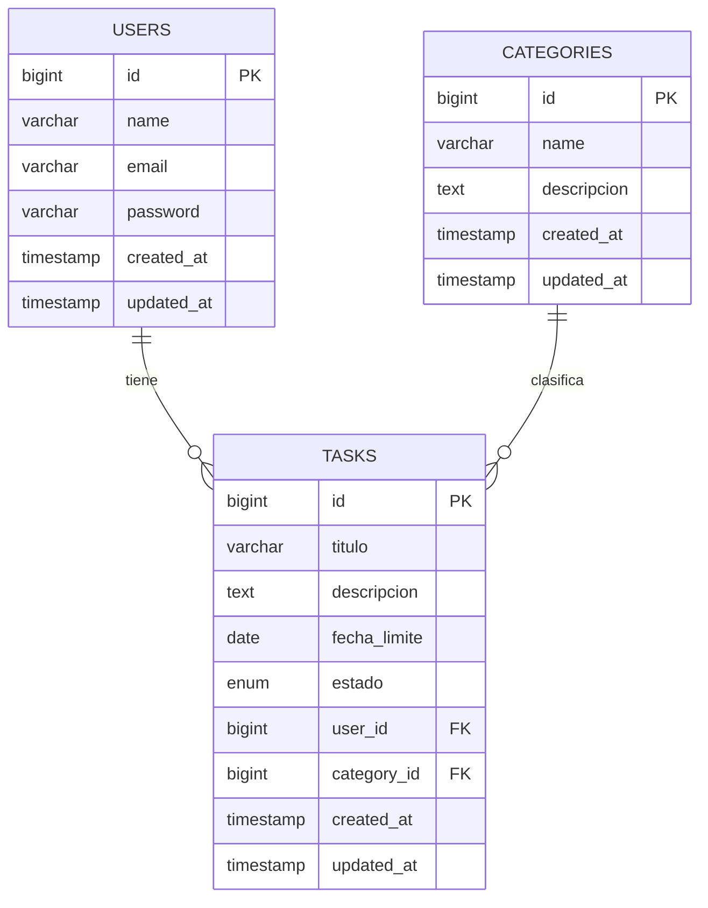

# Modelo Entidad-Relación - Task Manager

```mermaid
erDiagram
    USERS ||--o{ TASKS : tiene
    CATEGORIES ||--o{ TASKS : clasifica

    USERS {
        bigint id PK
        varchar name
        varchar email
        varchar password
        timestamp created_at
        timestamp updated_at
    }

    CATEGORIES {
        bigint id PK
        varchar name
        text descripcion
        timestamp created_at
        timestamp updated_at
    }

    TASKS {
        bigint id PK
        varchar titulo
        text descripcion
        date fecha_limite
        enum estado
        bigint user_id FK
        bigint category_id FK
        timestamp created_at
        timestamp updated_at
    }
```
