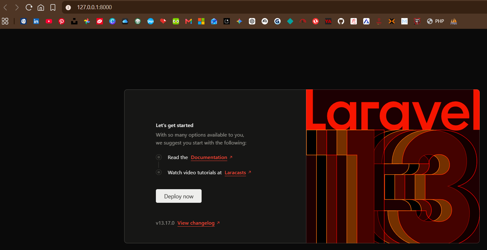
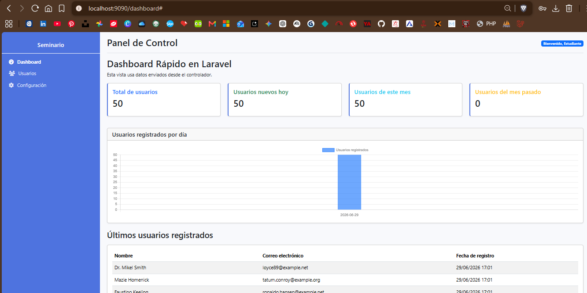

# Semana 2 - Instalación de Laravel

En esta actividad se realizó la instalación y verificación inicial de un proyecto Laravel.

El objetivo fue comprobar que el entorno de trabajo estuviera correctamente configurado con PHP, Composer y Laravel, además de validar que el proyecto cargara correctamente en el navegador.

## 1. Verificación de PHP y Composer

Se ejecutaron los siguientes comandos en la terminal:

```bash
php -v
composer --version
```

Con estos comandos se comprobó que PHP y Composer están instalados correctamente.


## 2. Estructura del proyecto Laravel

Se revisó la estructura del proyecto Laravel ejecutando:

```bash
ls -la
```

Con este comando se verificaron las carpetas y archivos principales del proyecto Laravel.


## 3. Pantalla de bienvenida de Laravel

Se ejecutó el proyecto Laravel y se verificó en el navegador que cargara correctamente la pantalla de bienvenida.



## 4. Archivos excluidos

El proyecto no debe subir al repositorio la carpeta:

```text
vendor/
```

Tampoco debe subir el archivo:

```text
.env
```

Estos archivos se excluyen mediante `.gitignore`.

La carpeta `vendor/` puede reconstruirse ejecutando:

```bash
composer install
```

## Ejercicio Dashboard con estadísticas y gráficos

En este ejercicio se desarrolló un dashboard básico en Laravel utilizando datos enviados desde un controlador hacia una vista Blade.

El dashboard muestra información estadística de los usuarios registrados en la base de datos, incluyendo:

- Total de usuarios registrados.
- Usuarios nuevos del día actual.
- Usuarios registrados durante el mes pasado.
- Gráfico de usuarios registrados por día usando Chart.js.
- Tabla con los últimos usuarios registrados y su correo electrónico.

### Archivos utilizados

- `app/Http/Controllers/DashboardController.php`
- `resources/views/dashboard.blade.php`
- `resources/views/layouts/app.blade.php`
- `routes/web.php`

### Ruta del dashboard

http://localhost:9090/dashboard

### Evidencia

